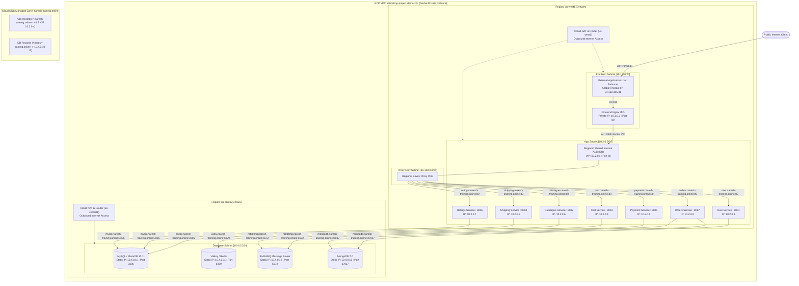

# E-Commerce Multi-Cloud Microservices

An enterprise-grade, highly available microservices infrastructure deployment on Google Cloud Platform (GCP) provisioned with Terraform.

---

## Multi-Region Architecture Diagram

---

## Service Port & IP Reference Table

| Tier | Component | Machine Type | Region | Subnet CIDR | IP / VIP | Port |
| :--- | :--- | :--- | :--- | :--- | :--- | :--- |
| **External** | External ALB | Global Managed | Global | N/A | `34.160.195.31` | `80` |
| **Frontend** | `frontend` | `e2-small` | `us-west1` | `10.1.0.0/24` | `10.1.0.2` (DHCP) | `80` (Nginx) |
| **Internal LB** | Shared App ILB | Regional Managed | `us-west1` | `10.2.0.0/24` | Reserved ILB IP | `80` |
| **ILB Proxy** | Envoy Proxy Pool | Regional Managed | `us-west1` | `10.128.0.0/24` | Regional Proxy Subnet | Ephemeral |
| **App** | `user` | `e2-small` | `us-west1` | `10.2.0.0/24` | `10.2.0.3` | `8001` |
| **App** | `cart` | `e2-small` | `us-west1` | `10.2.0.0/24` | `10.2.0.4` | `8003` |
| **App** | `payment` | `e2-small` | `us-west1` | `10.2.0.0/24` | `10.2.0.5` | `8005` |
| **App** | `catalogue` | `e2-small` | `us-west1` | `10.2.0.0/24` | `10.2.0.6` | `8002` |
| **App** | `ratings` | `e2-small` | `us-west1` | `10.2.0.0/24` | `10.2.0.7` | `8006` |
| **App** | `orders` | `e2-small` | `us-west1` | `10.2.0.0/24` | `10.2.0.8` | `8007` |
| **App** | `shipping` | `e2-small` | `us-west1` | `10.2.0.0/24` | `10.2.0.9` | `8004` |
| **Database** | `mysql` (MariaDB 10.11) | `e2-small` | `us-central1` | `10.4.0.0/24` | `10.4.0.10` (Static) | `3306` |
| **Database** | `valky` (Redis) | `e2-small` | `us-central1` | `10.4.0.0/24` | `10.4.0.11` (Static) | `6379` |
| **Database** | `rabbitmq` | `e2-small` | `us-central1` | `10.4.0.0/24` | `10.4.0.12` (Static) | `5672` |
| **Database** | `mongodb` (Mongo 7.0) | `e2-small` | `us-central1` | `10.4.0.0/24` | `10.4.0.13` (Static) | `27017` |

---

For in-depth deployment instructions, log troubleshooting, and GCP debugging procedures, see [terraform/gcp/README.md](terraform/gcp/README.md).
