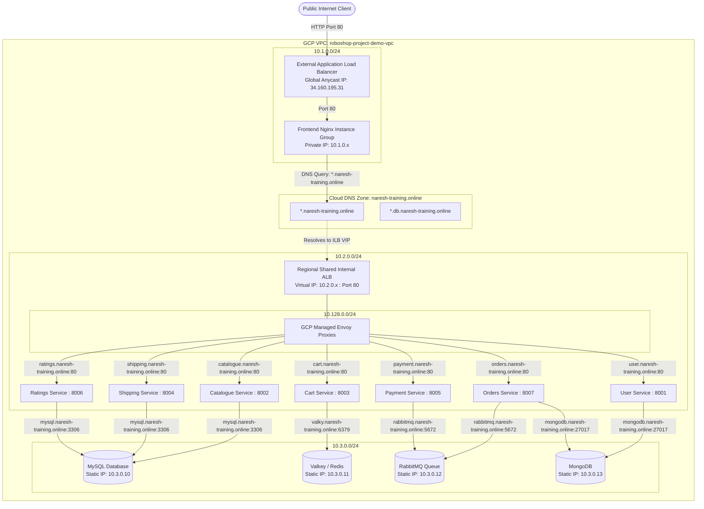

# E-Commerce Multi-Cloud Microservices on Google Cloud Platform (GCP)

This document details the end-to-end architecture, networking flow, and step-by-step troubleshooting and log-checking procedures for the RoboShop microservices infrastructure provisioned via Terraform on Google Cloud.

---

## Architecture Diagram



---

## Traffic Flow Summary

1. **Client to Frontend**:
   * Users hit `http://naresh-training.online` (or `http://34.160.195.31`).
   * The **Global External HTTP Load Balancer** proxies traffic to the **Frontend Nginx MIG** on port 80.

2. **Frontend to Microservices**:
   * Frontend Nginx proxies API calls (e.g., `/api/catalogue/`) to `http://catalogue.naresh-training.online:80`.
   * Cloud DNS resolves `*.naresh-training.online` to the **Internal Application Load Balancer (ILB)** private VIP in `10.2.0.0/24`.
   * The ILB uses **Host-based routing** to forward requests to the appropriate application MIG on its respective internal port (`8001` - `8007`).

3. **Microservices to Databases**:
   * App services query Cloud DNS for database endpoints (`mysql`, `valky`, `rabbitmq`, `mongodb`).
   * Cloud DNS maps to the reserved static internal IPs (`10.3.0.10` - `10.3.0.13`).
   * VPC Firewall permits TCP traffic directly from `app` VMs to `database` VMs.

---

## Service Port & IP Reference Table

| Tier | Component | Machine Type | Subnet CIDR | IP / VIP | Port |
| :--- | :--- | :--- | :--- | :--- | :--- |
| **External** | External ALB | Global Managed | N/A | `34.160.195.31` | `80` |
| **Frontend** | `frontend` | `n4-standard-2` | `10.1.0.0/24` | Dynamic DHCP | `80` (Nginx) |
| **Internal LB** | Shared App ILB | Regional Managed | `10.2.0.0/24` | Reserved ILB IP | `80` |
| **ILB Proxy** | Envoy Proxy Pool | N/A | `10.128.0.0/24` | Regional Proxy | Ephemeral |
| **App** | `user` | `n4-standard-2` | `10.2.0.0/24` | Dynamic MIG IP | `8001` |
| **App** | `catalogue` | `n4-standard-2` | `10.2.0.0/24` | Dynamic MIG IP | `8002` |
| **App** | `cart` | `n4-standard-2` | `10.2.0.0/24` | Dynamic MIG IP | `8003` |
| **App** | `shipping` | `n4-standard-2` | `10.2.0.0/24` | Dynamic MIG IP | `8004` |
| **App** | `payment` | `n4-standard-2` | `10.2.0.0/24` | Dynamic MIG IP | `8005` |
| **App** | `ratings` | `n4-standard-2` | `10.2.0.0/24` | Dynamic MIG IP | `8006` |
| **App** | `orders` | `n4-standard-2` | `10.2.0.0/24` | Dynamic MIG IP | `8007` |
| **Database** | `mysql` | `n4-standard-2` | `10.3.0.0/24` | `10.3.0.10` | `3306` |
| **Database** | `valky` (Redis) | `n4-standard-2` | `10.3.0.0/24` | `10.3.0.11` | `6379` |
| **Database** | `rabbitmq` | `n4-standard-2` | `10.3.0.0/24` | `10.3.0.12` | `5672` |
| **Database** | `mongodb` | `n4-standard-2` | `10.3.0.0/24` | `10.3.0.13` | `27017` |

---

## Log Checking & Troubleshooting Guide

### 1. Connecting to Any VM
You can connect securely using Google Cloud Identity-Aware Proxy (IAP) without needing a public IP:

```bash
# Connect using gcloud CLI:
gcloud compute ssh <INSTANCE_NAME> --zone=<ZONE> --tunnel-through-iap

# Example:
gcloud compute ssh roboshop-project-demo-frontend-igm-instance-xxxx --zone=us-west1-a --tunnel-through-iap
```

---

### 2. Checking the GCP Startup Script Logs
When a VM boots, GCP's metadata script runner executes your provisioning script (`frontend.sh`, `catalogue.sh`, etc.).

```bash
# View the entire startup script log
sudo journalctl -u google-startup-scripts.service --no-pager

# Stream/follow the startup script output live as it runs
sudo journalctl -u google-startup-scripts.service -f

# Filter startup logs from system messages
sudo grep "startup-script" /var/log/messages | less
```

---

### 3. Checking Application Service Logs (Systemd)

Check service status:
```bash
sudo systemctl status <service-name>

# Examples:
sudo systemctl status nginx
sudo systemctl status catalogue
sudo systemctl status cart
sudo systemctl status orders
sudo systemctl status valkey
sudo systemctl status mysqld
sudo systemctl status mongod
sudo systemctl status rabbitmq-server
```

Live stream service logs:
```bash
# Follow logs in real-time (-f) showing the last 100 lines (-n 100)
sudo journalctl -u <service-name> -f -n 100

# Examples:
sudo journalctl -u catalogue -f -n 100
sudo journalctl -u orders -f -n 100
sudo journalctl -u nginx -f -n 100
```

---

### 4. Checking Nginx Web Server Logs (Frontend VM)

```bash
# Check Nginx error log (crucial for 404, 502 Bad Gateway, 503 Service Unavailable)
sudo tail -f /var/log/nginx/error.log

# Check Nginx access log (shows live client requests)
sudo tail -f /var/log/nginx/access.log
```

---

### 5. Checking Load Balancer Health Status from your Local Terminal

To check if backends are healthy according to Google Cloud:

```bash
# Check External Frontend Load Balancer backend health:
gcloud compute backend-services get-health backend --global

# Check Internal Application Load Balancer backend health:
gcloud compute backend-services get-health roboshop-project-demo-catalogue-backend --region=us-west1
gcloud compute backend-services get-health roboshop-project-demo-orders-backend --region=us-west1
```

---

### 6. Checking Serial Port Logs without SSHing into the VM

If a VM fails to boot or SSH is unreachable, you can view the live console output directly:

```bash
gcloud compute instances get-serial-port-output <INSTANCE_NAME> --zone=<ZONE>
```

---

## Common Gotchas & Architectural Solutions

| Issue | Root Cause | Solution |
| :--- | :--- | :--- |
| **`unconditional drop overload`** | 0 instances in the backend group. | Check MIG instances; ensure disk type matches machine type (`hyperdisk-balanced` for `n4`). |
| **`503 no healthy upstream`** | Health check failed on port 80. | Check `journalctl -u google-startup-scripts.service`; ensure Nginx started and served `index.html`. |
| **`None of the backends have a valid capacity`** | `balancing_mode = "UTILIZATION"` missing metrics. | Add `max_utilization = 0.8` and `capacity_scaler = 1.0` in the backend block. |
| **`Instance Template in use by IGM`** | Destroy-then-create ordering conflict. | Use `name_prefix = "*-template-"` and `lifecycle { create_before_destroy = true }`. |
| **`Invalid value for max_surge_fixed`** | Regional MIGs require surge >= number of zones. | Set `max_surge_fixed = 3` (or 0) for regional instance groups across 3 zones. |
